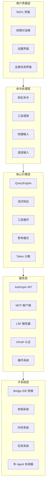

# Claude Code 架构文档

> 本项目是 Anthropic 官方 Claude Code CLI 工具的完整源代码架构分析与中文文档。

---

## 文档目录

| 文档 | 描述 |
|------|------|
| [架构总览](architecture.md) | 核心架构、启动流程、状态管理、渲染机制 |
| [工具系统](tools.md) | ~40 个 Agent 工具的完整目录与权限模型 |
| [命令系统](commands.md) | ~85 个斜杠命令的分类与功能说明 |
| [子系统详解](subsystems.md) | Bridge、MCP、权限、插件、技能、任务、内存、语音等 |
| [技术栈详情](tech-stack.md) | 运行时、框架、依赖、构建系统详解 |
| [数据流](data-flow.md) | 从用户输入到 API 响应的完整数据流转 |
| [代码探索指南](exploration-guide.md) | 如何阅读和理解源码 |
| [部署与运维](deployment.md) | Docker 部署、配置管理、监控 |

---

## 项目概览

### 基本信息

| 属性 | 详情 |
|------|------|
| **发布时间** | 2026-03-31 |
| **编程语言** | TypeScript (严格模式) |
| **运行时** | [Bun](https://bun.sh) |
| **终端 UI** | React + Ink |
| **代码规模** | ~1,900 个文件 · 512,000+ 行代码 |

### 什么是 Claude Code？

Claude Code 是 Anthropic 官方的命令行工具，允许用户直接在终端中与 Claude AI 交互，支持：

- **文件编辑** - 读取、写入、编辑文件
- **命令执行** - 运行 shell 命令和脚本
- **代码搜索** - 使用 ripgrep 搜索代码库
- **Git 工作流** - 提交、分支、PR 管理
- **多 Agent 协调** - 并行子 Agent 处理复杂任务
- **IDE 集成** - VS Code、JetBrains 桥接
- **MCP 协议** - Model Context Protocol 支持

---

## 系统架构图



---

## 目录结构

```
src/
├── main.tsx                 # 入口点 — Commander.js CLI 解析器 + React/Ink 渲染器
├── QueryEngine.ts           # 核心 LLM API 调用器 (~46K 行)
├── Tool.ts                  # 工具类型定义 (~29K 行)
├── commands.ts              # 命令注册表 (~25K 行)
├── tools.ts                 # 工具注册表
├── context.ts               # 系统/用户上下文收集
├── cost-tracker.ts          # Token 成本追踪
│
├── tools/                   # Agent 工具实现 (~40 个)
├── commands/                # 斜杠命令实现 (~85 个)
├── components/              # Ink UI 组件 (~140 个)
├── services/                # 外部服务集成
├── hooks/                   # React hooks (含权限检查)
├── types/                   # TypeScript 类型定义
├── utils/                   # 工具函数
├── screens/                 # 全屏 UI (Doctor, REPL, Resume)
│
├── bridge/                  # IDE 集成 (VS Code, JetBrains)
├── coordinator/             # 多 Agent 编排
├── plugins/                 # 插件系统
├── skills/                  # 技能系统
├── server/                  # 服务器模式
├── remote/                  # 远程会话
├── memdir/                  # 持久化内存目录
├── tasks/                   # 任务管理
├── state/                   # 状态管理
│
├── voice/                   # 语音输入
├── vim/                     # Vim 模式
├── keybindings/             # 键位配置
├── schemas/                 # 配置模式 (Zod)
├── migrations/              # 配置迁移
├── entrypoints/             # 初始化逻辑
├── query/                   # 查询管道
├── ink/                     # Ink 渲染器包装
├── buddy/                   # 陪伴精灵 (彩蛋 🐣)
├── native-ts/               # 原生 TypeScript 工具
├── outputStyles/            # 输出样式
└── upstreamproxy/           # 代理配置
```

---

## 关键文件

| 文件 | 行数 | 用途 |
|------|------:|------|
| `QueryEngine.ts` | ~46K | 核心 LLM API 引擎 — 流式处理、工具循环、思考模式、重试、Token 计数 |
| `Tool.ts` | ~29K | 所有工具的基类型/接口 — 输入模式、权限、进度状态 |
| `commands.ts` | ~25K | 命令注册与执行，支持条件按环境导入 |
| `main.tsx` | — | CLI 解析器 + React/Ink 渲染器；启动时并行化 MDM、钥匙串、GrowthBook |

---

## 核心设计模式

### 1. 并行预取 (Parallel Prefetch)

启动优化：MDM 设置、钥匙串读取和 API 预连接在重模块求值之前作为副作用并行触发：

```typescript
// main.tsx
startMdmRawRead()
startKeychainPrefetch()
```

### 2. 延迟加载 (Lazy Loading)

OpenTelemetry (~400KB) 和 gRPC (~700KB) 仅在需要时通过动态 `import()` 加载。

### 3. Agent 集群 (Agent Swarms)

通过 `AgentTool` 生成子 Agent，`coordinator/` 处理编排。`TeamCreateTool` 支持团队级并行工作。

### 4. 技能系统 (Skill System)

在 `skills/` 中定义，通过 `SkillTool` 执行。用户可以添加自定义技能。

### 5. 插件架构 (Plugin Architecture)

通过 `plugins/` 子系统加载内置和第三方插件。

---

## 特性开关

构建时通过 Bun 的 `bun:bundle` 进行死代码消除：

```typescript
import { feature } from 'bun:bundle'

const voiceCommand = feature('VOICE_MODE')
  ? require('./commands/voice/index.js').default
  : null
```

主要开关：`PROACTIVE` · `KAIROS` · `BRIDGE_MODE` · `DAEMON` · `VOICE_MODE` · `AGENT_TRIGGERS` · `MONITOR_TOOL`

---

## 版权说明

本文档基于 Anthropic 官方发布的 Claude Code 源代码（2026-03-31）进行架构分析与中文翻译。原始代码版权归 [Anthropic](https://www.anthropic.com) 所有。

