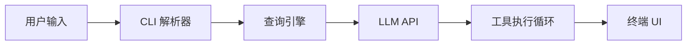
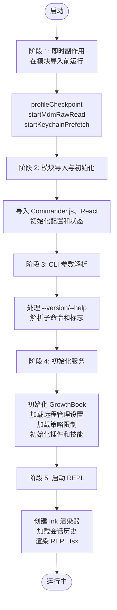
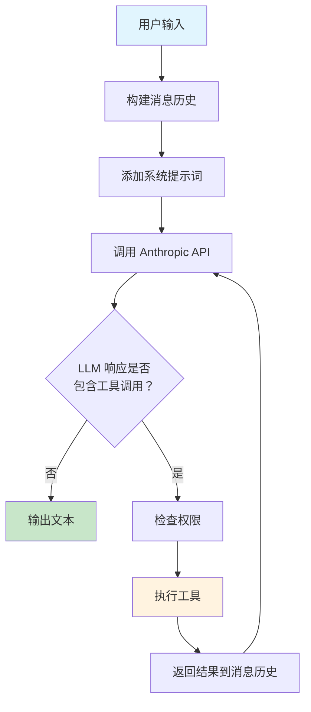
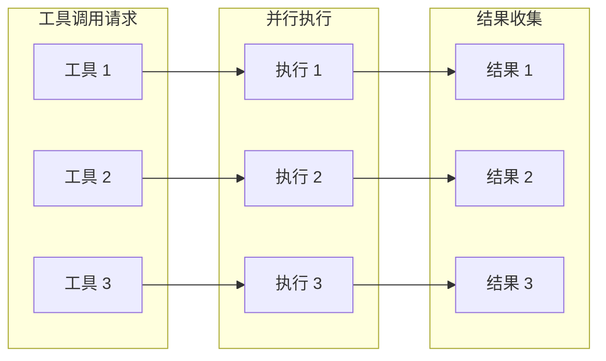

# 架构总览

> 深入解析 Claude Code 的内部结构与设计原理。

---

## 高层架构

Claude Code 是一个终端原生的 AI 编程助手，以单一二进制 CLI 形式构建。其架构采用**管道模型**：



整个 UI 层使用 **React + Ink**（面向终端的 React）构建，使其成为一个完全响应式的 CLI 应用，具备组件、hooks、状态管理等你在 React Web 应用中期望的所有模式 —— 只是渲染到终端。

---

## 核心管道流程

### 1. 入口点 (`src/main.tsx`)

CLI 解析器使用 [Commander.js](https://github.com/tj/commander.js) (`@commander-js/extra-typings`) 构建。启动时：

- 在重模块导入之前触发并行预取副作用（MDM 设置、钥匙串、API 预连接）
- 解析 CLI 参数和标志
- 初始化 React/Ink 渲染器
- 移交给 REPL 启动器 (`src/replLauncher.tsx`)

### 2. 初始化 (`src/entrypoints/`)

| 文件 | 角色 |
|------|------|
| `cli.tsx` | CLI 会话编排 — 从启动到 REPL 的主路径 |
| `init.ts` | 配置、遥测、OAuth、MDM 策略初始化 |
| `mcp.ts` | MCP 服务器模式入口点（Claude Code 作为 MCP 服务器） |
| `sdk/` | Agent SDK — 用于嵌入 Claude Code 的编程 API |

启动时执行并行初始化：MDM 策略读取、钥匙串预取、特性标志检查，然后核心初始化。

### 3. 查询引擎 (`src/QueryEngine.ts`, ~46K 行)

Claude Code 的心脏。处理：

- **流式响应** — 来自 Anthropic API
- **工具调用循环** — 当 LLM 请求工具时，执行它并将结果反馈
- **思考模式** — 带预算管理的扩展思考
- **重试逻辑** — 对瞬态故障自动重试并退避
- **Token 计数** — 追踪每轮输入/输出 token 和成本
- **上下文管理** — 管理对话历史和上下文窗口

### 4. 工具系统 (`src/Tool.ts` + `src/tools/`)

Claude 可调用的每个能力都是一个**工具**。每个工具自包含：

- **输入模式** (Zod 验证)
- **权限模型** (需要什么用户批准)
- **执行逻辑** (实际实现)
- **UI 组件** (调用/结果如何在终端渲染)

工具在 `src/tools.ts` 中注册，并在工具调用循环期间被查询引擎发现。

参见 [工具系统](tools.md) 获取完整目录。

### 5. 命令系统 (`src/commands.ts` + `src/commands/`)

用户面向的斜杠命令（`/commit`、`/review`、`/mcp` 等），可在 REPL 中输入。三种类型：

| 类型 | 描述 | 示例 |
|------|------|------|
| **PromptCommand** | 发送带注入工具的格式化提示给 LLM | `/review`、`/commit` |
| **LocalCommand** | 进程内运行，返回纯文本 | `/cost`、`/version` |
| **LocalJSXCommand** | 进程内运行，返回 React JSX | `/doctor`、`/install` |

命令在 `src/commands.ts` 中注册，并通过 REPL 中的 `/command-name` 调用。

参见 [命令系统](commands.md) 获取完整目录。

---

## 状态管理

Claude Code 使用 **React context + 自定义存储** 模式：

| 组件 | 位置 | 用途 |
|------|------|------|
| `AppState` | `src/state/AppStateStore.ts` | 全局可变状态对象 |
| Context Providers | `src/context/` | 通知、统计、FPS 的 React context |
| Selectors | `src/state/` | 派生状态函数 |
| Change Observers | `src/state/onChangeAppState.ts` | 状态变化的副作用 |

`AppState` 对象被传递到工具上下文中，使工具可以访问对话历史、设置和运行时状态。

---

## UI 层

### 组件 (`src/components/`, ~140 组件)

- 使用 Ink 原语（`Box`、`Text`、`useInput()`）的功能性 React 组件
- 使用 [Chalk](https://github.com/chalk/chalk) 进行终端颜色样式设置
- 启用 React Compiler 进行优化重渲染
- 设计系统原语在 `src/components/design-system/`

### 屏幕 (`src/screens/`)

全屏 UI 模式：

| 屏幕 | 用途 |
|------|------|
| `REPL.tsx` | 主交互式 REPL（默认屏幕） |
| `Doctor.tsx` | 环境诊断 (`/doctor`) |
| `ResumeConversation.tsx` | 会话恢复 (`/resume`) |

### Hooks (`src/hooks/`, ~80 hooks)

标准 React hooks 模式。主要类别：

- **权限 hooks** — `useCanUseTool`、`src/hooks/toolPermission/`
- **IDE 集成** — `useIDEIntegration`、`useIdeConnectionStatus`、`useDiffInIDE`
- **输入处理** — `useTextInput`、`useVimInput`、`usePasteHandler`、`useInputBuffer`
- **会话管理** — `useSessionBackgrounding`、`useRemoteSession`、`useAssistantHistory`
- **插件/技能 hooks** — `useManagePlugins`、`useSkillsChange`
- **通知 hooks** — `src/hooks/notifs/` (速率限制、弃用警告等)

---

## 配置与模式

### 配置模式 (`src/schemas/`)

基于 Zod v4 的所有配置模式：

- 用户设置
- 项目级设置
- 组织/企业策略
- 权限规则

### 迁移 (`src/migrations/`)

处理版本之间的配置格式变更 — 读取旧配置并转换到当前模式。

---

## 构建系统

### Bun 运行时

Claude Code 在 [Bun](https://bun.sh) 上运行（而非 Node.js）。关键影响：

- 无需转译步骤的原生 JSX/TSX 支持
- `bun:bundle` 特性标志用于死代码消除
- 使用 `.js` 扩展名的 ES 模块（Bun 约定）

### 特性开关（死代码消除）

```typescript
import { feature } from 'bun:bundle'

// 非活动特性标志内的代码在构建时完全被剥离
if (feature('VOICE_MODE')) {
  const voiceCommand = require('./commands/voice/index.js').default
}
```

主要开关：

| 开关 | 特性 |
|------|------|
| `PROACTIVE` | 主动 Agent 模式（自主操作） |
| `KAIROS` | Kairos 子系统 |
| `BRIDGE_MODE` | IDE 桥接集成 |
| `DAEMON` | 后台守护模式 |
| `VOICE_MODE` | 语音输入/输出 |
| `AGENT_TRIGGERS` | 触发式 Agent 操作 |
| `MONITOR_TOOL` | 监控工具 |
| `COORDINATOR_MODE` | 多 Agent 协调器 |
| `WORKFLOW_SCRIPTS` | 工作流自动化脚本 |

### 延迟加载

通过动态 `import()` 延迟加载重模块直到首次使用：

- OpenTelemetry (~400KB)
- gRPC (~700KB)
- 其他可选依赖

---

## 错误处理与遥测

### 遥测 (`src/services/analytics/`)

- [GrowthBook](https://www.growthbook.io/) 用于特性标志和 A/B 测试
- [OpenTelemetry](https://opentelemetry.io/) 用于分布式追踪和指标
- 自定义事件追踪用于使用分析

### 成本追踪 (`src/cost-tracker.ts`)

追踪每轮对话的 token 使用和估计成本。可通过 `/cost` 命令访问。

### 诊断 (`/doctor` 命令)

`Doctor.tsx` 屏幕运行环境检查：API 连接、认证、工具可用性、MCP 服务器状态等。

---

## 并发模型

Claude Code 使用**单线程事件循环**（Bun/Node.js 模型），配合：

- 用于 I/O 操作的 async/await
- React 的并发渲染用于 UI 更新
- 用于 CPU 密集型任务的 Web Workers 或子进程（gRPC 等）
- 工具并发安全 — 每个工具声明 `isConcurrencySafe()` 以指示是否可以与其他工具并行运行

---

## 启动流程详解



---

## 工具调用循环



### 并行工具执行



---

## 相关文档

- [工具系统](tools.md) — 所有 40 个 Agent 工具的完整目录
- [命令系统](commands.md) — 所有斜杠命令的完整目录
- [子系统详解](subsystems.md) — Bridge、MCP、权限、技能、插件等
- [代码探索指南](exploration-guide.md) — 如何浏览此代码库
