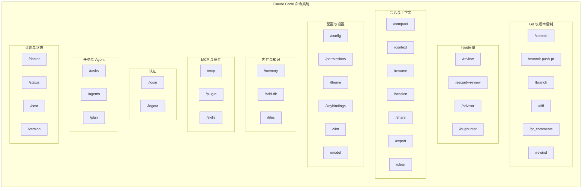
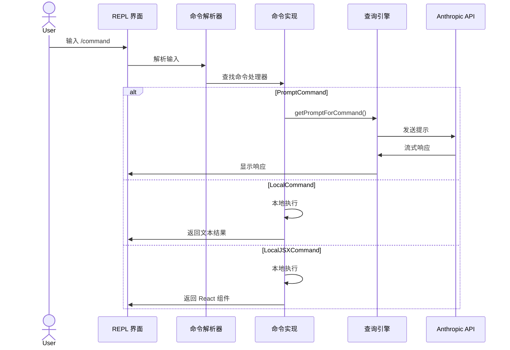

# 命令系统

> Claude Code 中所有斜杠命令的完整目录。

---

## 概览

命令是用户通过在 REPL 中输入 `/` 前缀调用的操作（例如 `/commit`、`/review`）。它们位于 `src/commands/` 中，并在 `src/commands.ts` 中注册。

### 命令类型

| 类型 | 描述 | 示例 |
|------|------|------|
| **PromptCommand** | 发送带注入工具的格式化提示给 LLM | `/review`、`/commit` |
| **LocalCommand** | 进程内运行，返回纯文本 | `/cost`、`/version` |
| **LocalJSXCommand** | 进程内运行，返回 React JSX | `/install`、`/doctor` |

### 命令定义模式

```typescript
const command = {
  type: 'prompt',
  name: 'my-command',
  description: 'What this command does',
  progressMessage: 'working...',
  allowedTools: ['Bash(git *)', 'FileRead(*)'],
  source: 'builtin',
  async getPromptForCommand(args, context) {
    return [{ type: 'text', text: '...' }]
  },
} satisfies Command
```

---

## 命令分类架构



---

## Git 与版本控制

| 命令 | 源文件 | 描述 |
|---------|--------|-------------|
| `/commit` | `commit.ts` | 使用 AI 生成的消息创建 git 提交 |
| `/commit-push-pr` | `commit-push-pr.ts` | 一步完成提交、推送和创建 PR |
| `/branch` | `branch/` | 创建或切换 git 分支 |
| `/diff` | `diff/` | 查看文件变更（暂存、未暂存或与某引用对比） |
| `/pr_comments` | `pr_comments/` | 查看和处理 PR 审查评论 |
| `/rewind` | `rewind/` | 回退到之前的状态 |

---

## 代码质量

| 命令 | 源文件 | 描述 |
|---------|--------|-------------|
| `/review` | `review.ts` | 对暂存/未暂存变更进行 AI 驱动的代码审查 |
| `/security-review` | `security-review.ts` | 安全聚焦的代码审查 |
| `/advisor` | `advisor.ts` | 获取架构或设计建议 |
| `/bughunter` | `bughunter/` | 在代码库中查找潜在 bug |

---

## 会话与上下文

| 命令 | 源文件 | 描述 |
|---------|--------|-------------|
| `/compact` | `compact/` | 压缩对话上下文以容纳更多历史 |
| `/context` | `context/` | 可视化当前上下文（文件、内存等） |
| `/resume` | `resume/` | 恢复之前的对话会话 |
| `/session` | `session/` | 管理会话（列出、切换、删除） |
| `/share` | `share/` | 通过链接分享会话 |
| `/export` | `export/` | 导出对话到文件 |
| `/summary` | `summary/` | 生成当前会话的总结 |
| `/clear` | `clear/` | 清除对话历史 |

---

## 配置与设置

| 命令 | 源文件 | 描述 |
|---------|--------|-------------|
| `/config` | `config/` | 查看或修改 Claude Code 设置 |
| `/permissions` | `permissions/` | 管理工具权限规则 |
| `/theme` | `theme/` | 更改终端颜色主题 |
| `/output-style` | `output-style/` | 更改输出格式样式 |
| `/color` | `color/` | 切换颜色输出 |
| `/keybindings` | `keybindings/` | 查看或自定义键位绑定 |
| `/vim` | `vim/` | 切换输入的 vim 模式 |
| `/effort` | `effort/` | 调整响应努力级别 |
| `/model` | `model/` | 切换活动模型 |
| `/privacy-settings` | `privacy-settings/` | 管理隐私/数据设置 |
| `/fast` | `fast/` | 切换快速模式（更短响应） |
| `/brief` | `brief.ts` | 切换简要输出模式 |

---

## 内存与知识

| 命令 | 源文件 | 描述 |
|---------|--------|-------------|
| `/memory` | `memory/` | 管理持久内存（CLAUDE.md 文件） |
| `/add-dir` | `add-dir/` | 添加目录到项目上下文 |
| `/files` | `files/` | 列出当前上下文中的文件 |

---

## MCP 与插件

| 命令 | 源文件 | 描述 |
|---------|--------|-------------|
| `/mcp` | `mcp/` | 管理 MCP 服务器连接 |
| `/plugin` | `plugin/` | 安装、移除或管理插件 |
| `/reload-plugins` | `reload-plugins/` | 重新加载所有已安装插件 |
| `/skills` | `skills/` | 查看和管理技能 |

---

## 认证

| 命令 | 源文件 | 描述 |
|---------|--------|-------------|
| `/login` | `login/` | 使用 Anthropic 认证 |
| `/logout` | `logout/` | 登出 |
| `/oauth-refresh` | `oauth-refresh/` | 刷新 OAuth 令牌 |

---

## 任务与 Agents

| 命令 | 源文件 | 描述 |
|---------|--------|-------------|
| `/tasks` | `tasks/` | 管理后台任务 |
| `/agents` | `agents/` | 管理子 Agent |
| `/ultraplan` | `ultraplan.tsx` | 生成详细的执行计划 |
| `/plan` | `plan/` | 进入计划模式 |

---

## 诊断与状态

| 命令 | 源文件 | 描述 |
|---------|--------|-------------|
| `/doctor` | `doctor/` | 运行环境诊断 |
| `/status` | `status/` | 显示系统和会话状态 |
| `/stats` | `stats/` | 显示会话统计 |
| `/cost` | `cost/` | 显示 token 使用和估计成本 |
| `/version` | `version.ts` | 显示 Claude Code 版本 |
| `/usage` | `usage/` | 显示详细 API 使用 |
| `/extra-usage` | `extra-usage/` | 显示扩展使用详情 |
| `/rate-limit-options` | `rate-limit-options/` | 查看速率限制配置 |

---

## 安装与设置

| 命令 | 源文件 | 描述 |
|---------|--------|-------------|
| `/install` | `install.tsx` | 安装或更新 Claude Code |
| `/upgrade` | `upgrade/` | 升级到最新版本 |
| `/init` | `init.ts` | 初始化项目（创建 CLAUDE.md） |
| `/init-verifiers` | `init-verifiers.ts` | 设置验证器 hooks |
| `/onboarding` | `onboarding/` | 运行首次设置向导 |
| `/terminalSetup` | `terminalSetup/` | 配置终端集成 |

---

## IDE 与桌面集成

| 命令 | 源文件 | 描述 |
|---------|--------|-------------|
| `/bridge` | `bridge/` | 管理 IDE 桥接连接 |
| `/bridge-kick` | `bridge-kick.ts` | 强制重启 IDE 桥接 |
| `/ide` | `ide/` | 在 IDE 中打开 |
| `/desktop` | `desktop/` | 移交到桌面应用 |
| `/mobile` | `mobile/` | 移交到移动应用 |
| `/teleport` | `teleport/` | 将会话传输到另一设备 |

---

## 远程与环境

| 命令 | 源文件 | 描述 |
|---------|--------|-------------|
| `/remote-env` | `remote-env/` | 配置远程环境 |
| `/remote-setup` | `remote-setup/` | 设置远程会话 |
| `/env` | `env/` | 查看环境变量 |
| `/sandbox-toggle` | `sandbox-toggle/` | 切换沙盒模式 |

---

## 其他

| 命令 | 源文件 | 描述 |
|---------|--------|-------------|
| `/help` | `help/` | 显示帮助和可用命令 |
| `/exit` | `exit/` | 退出 Claude Code |
| `/copy` | `copy/` | 复制内容到剪贴板 |
| `/feedback` | `feedback/` | 发送反馈给 Anthropic |
| `/release-notes` | `release-notes/` | 查看发布说明 |
| `/rename` | `rename/` | 重命名当前会话 |
| `/tag` | `tag/` | 标记当前会话 |
| `/insights` | `insights.ts` | 显示代码库洞察 |
| `/stickers` | `stickers/` | 彩蛋 — 贴纸 |
| `/good-claude` | `good-claude/` | 彩蛋 — 表扬 Claude |
| `/voice` | `voice/` | 切换语音输入模式 |
| `/chrome` | `chrome/` | Chrome 扩展集成 |
| `/issue` | `issue/` | 提交 GitHub issue |
| `/thinkback` | `thinkback/` | 回放 Claude 的思考过程 |
| `/passes` | `passes/` | 多遍执行 |
| `/x402` | `x402/` | x402 支付协议集成 |

---

## 内部/调试命令

| 命令 | 源文件 | 描述 |
|---------|--------|-------------|
| `/ant-trace` | `ant-trace/` | Anthropic 内部追踪 |
| `/autofix-pr` | `autofix-pr/` | 自动修复 PR 问题 |
| `/backfill-sessions` | `backfill-sessions/` | 回填会话数据 |
| `/break-cache` | `break-cache/` | 使缓存失效 |
| `/btw` | `btw/` | "顺便说一下" 插话 |
| `/ctx_viz` | `ctx_viz/` | 上下文可视化（调试） |
| `/debug-tool-call` | `debug-tool-call/` | 调试特定工具调用 |
| `/heapdump` | `heapdump/` | 转储堆进行内存分析 |
| `/hooks` | `hooks/` | 管理 hook 脚本 |
| `/mock-limits` | `mock-limits/` | 模拟速率限制用于测试 |
| `/perf-issue` | `perf-issue/` | 报告性能问题 |
| `/reset-limits` | `reset-limits/` | 重置速率限制计数器 |

---

## 命令调用流程



---

## 相关文档

- [架构总览](architecture.md) — 命令系统如何适应管道
- [工具系统](tools.md) — 与命令配合的 Agent 工具
- [代码探索指南](exploration-guide.md) — 查找命令源代码
