# 数据流

> 从用户输入到 API 响应的完整数据流转。

---

## 高层数据流

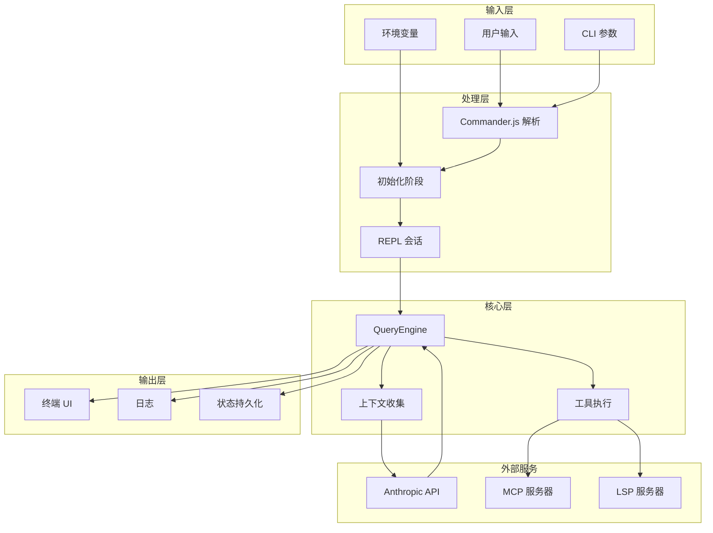

---

## 启动阶段数据流

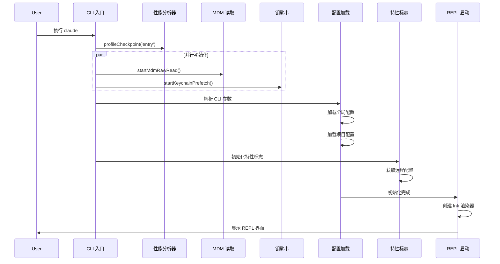

---

## 对话数据流

### 用户消息处理

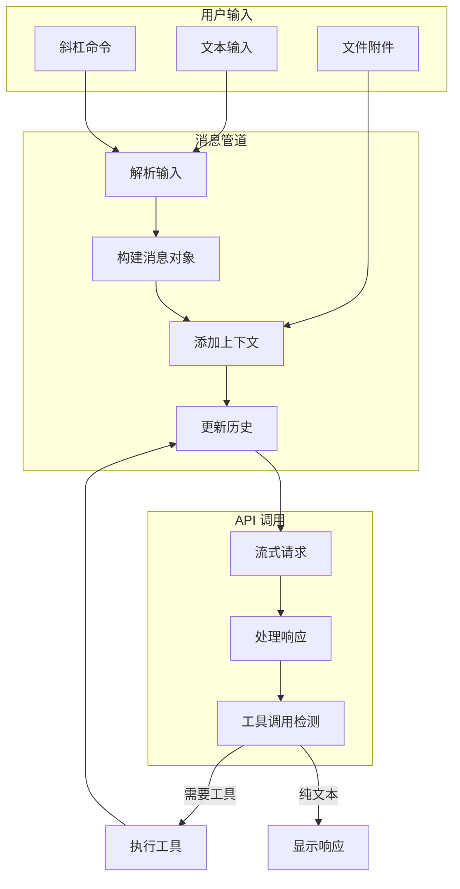

### 完整对话循环

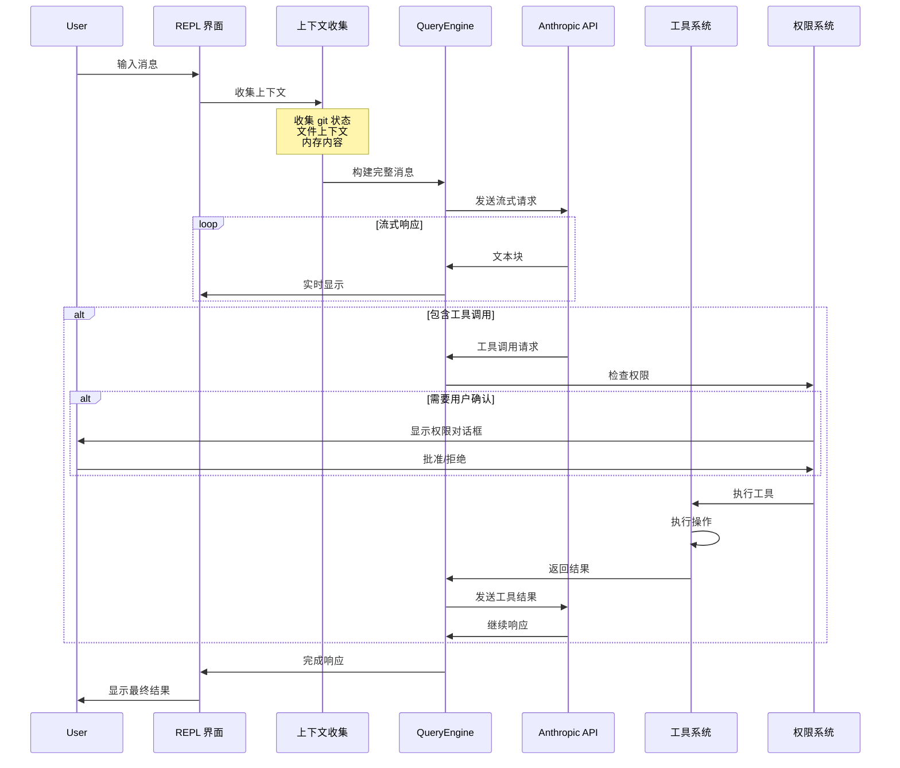

---

## 工具调用数据流

### 工具执行流程

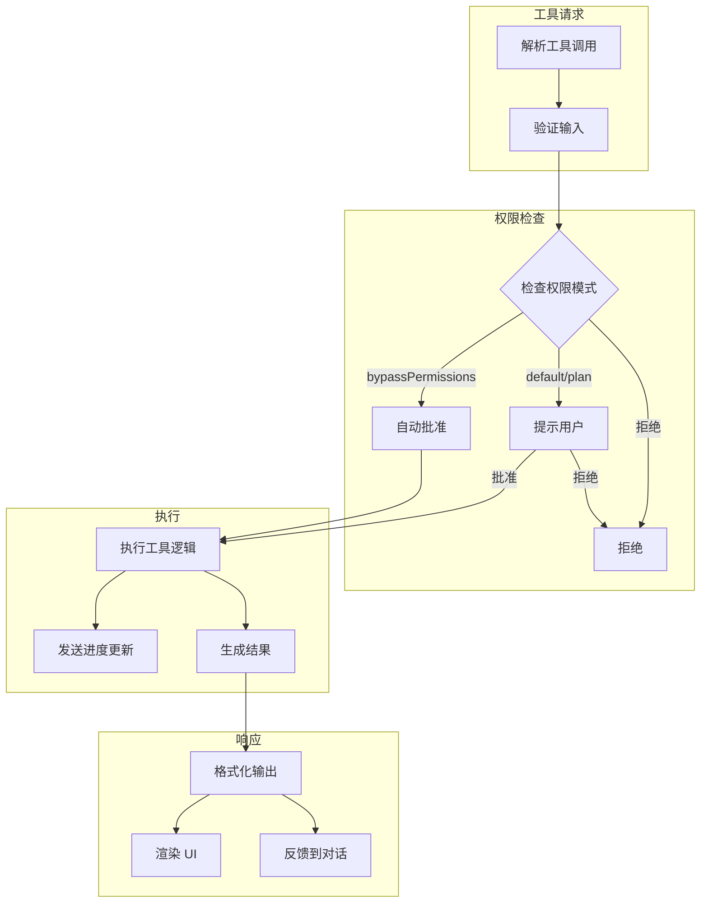

### 并发工具执行

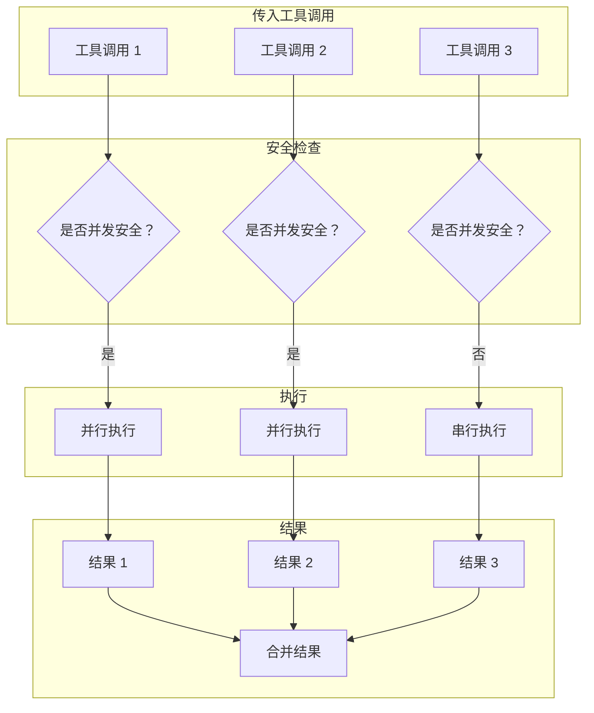

---

## 上下文收集数据流

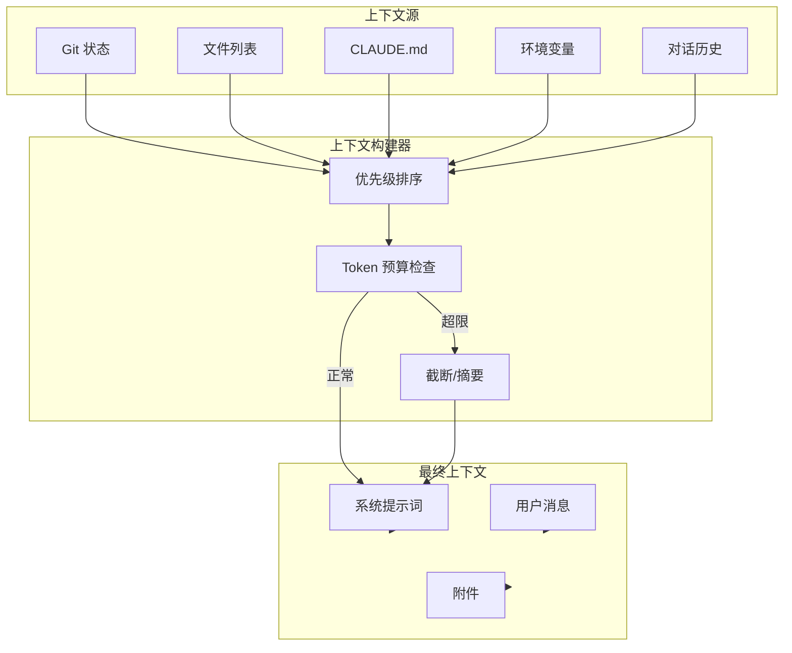

---

## 状态管理数据流

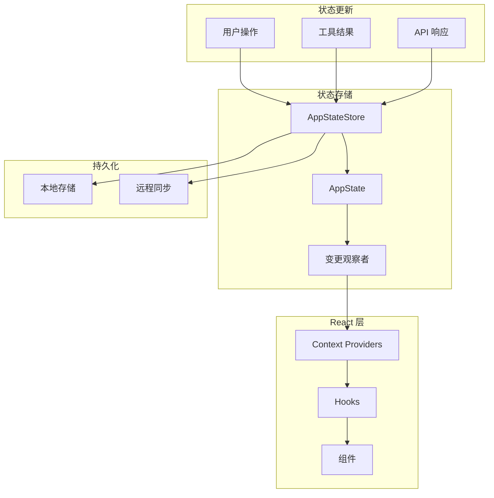

---

## MCP 数据流

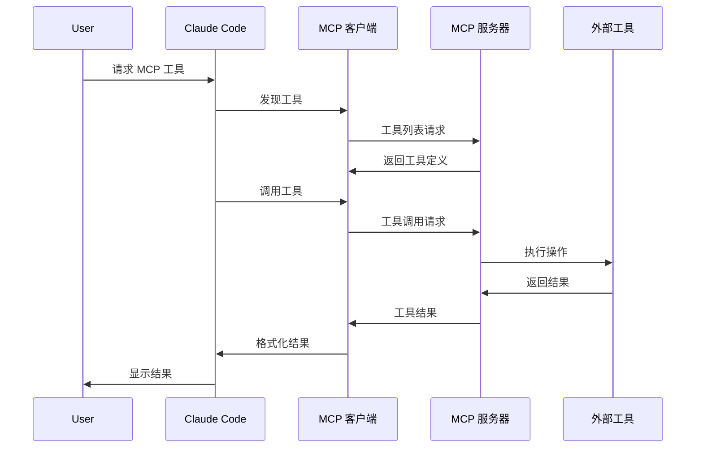

---

## Bridge (IDE) 数据流

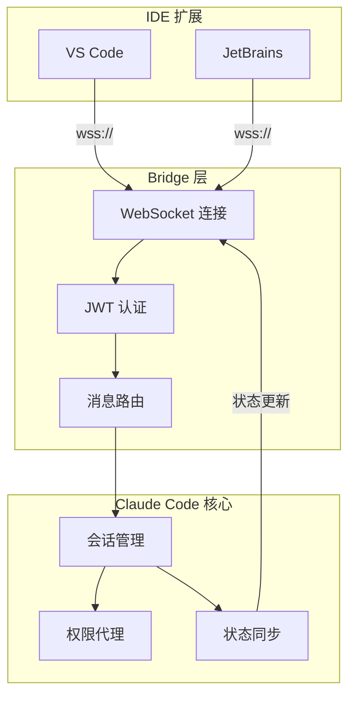

---

## 错误处理数据流

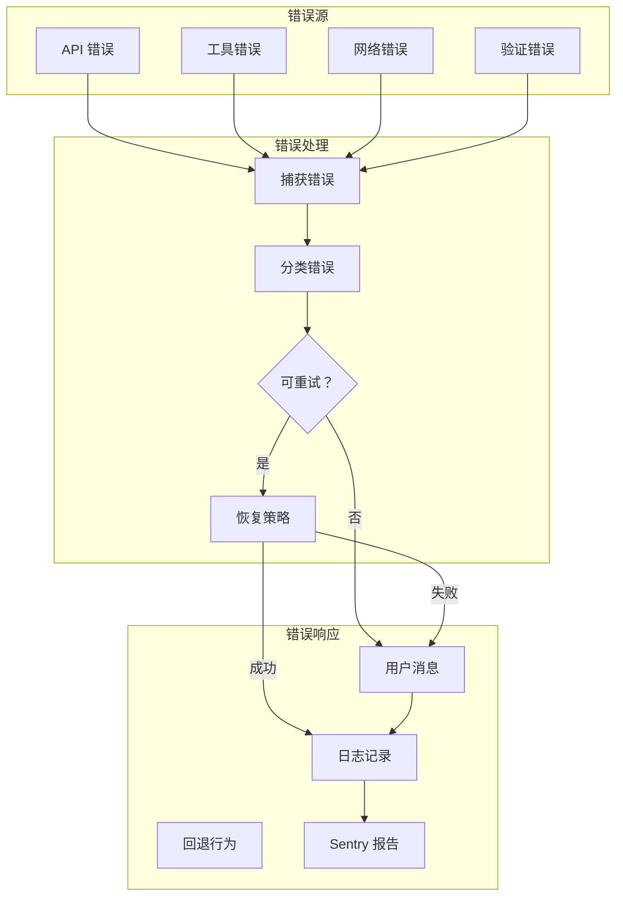

---

## 相关文档

- [架构总览](architecture.md) — 数据流如何适应整体架构
- [子系统详解](subsystems.md) — 每个子系统内部的数据流
