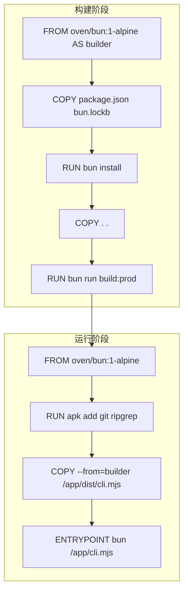
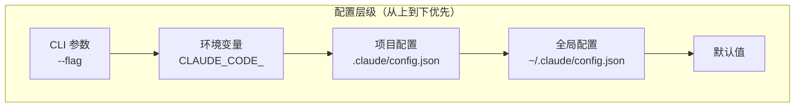
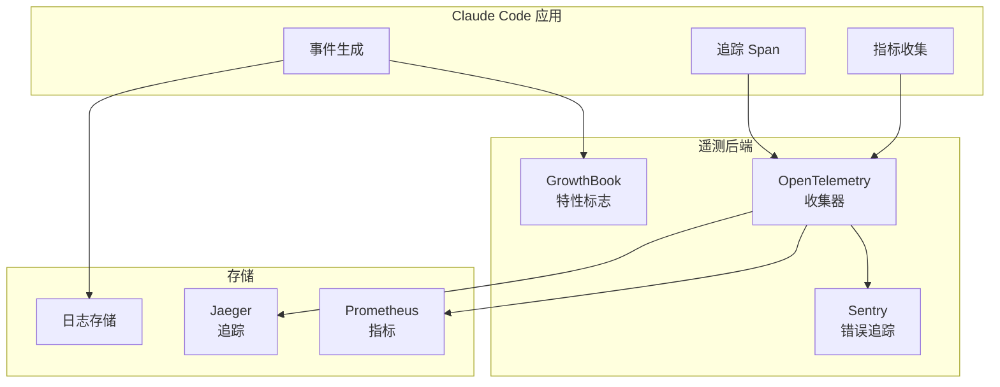
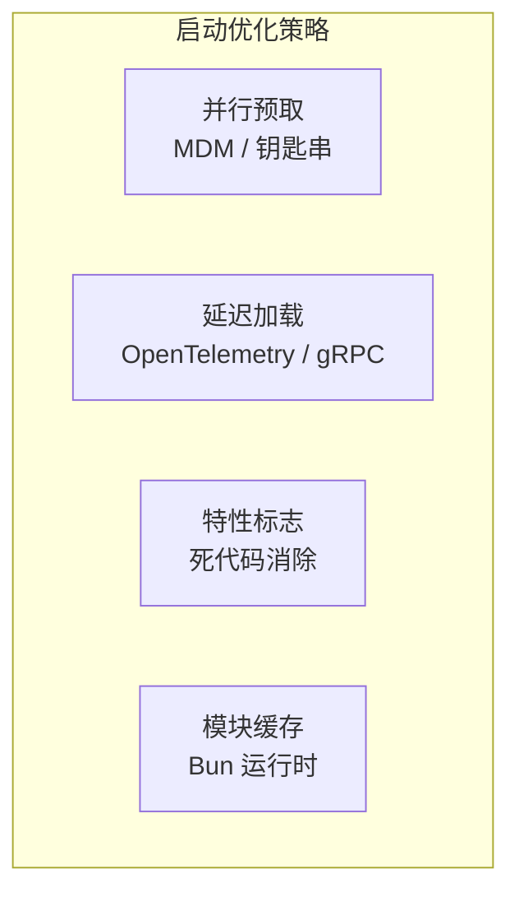
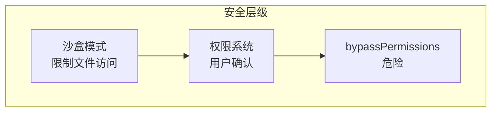

# 部署与运维

> Claude Code 的生产环境部署、配置和监控指南。

---

## Docker 部署

### 多阶段构建



### Dockerfile 详解

```dockerfile
# ─────────────────────────────────────────────────────────────
# Claude Code CLI — 生产容器
# ─────────────────────────────────────────────────────────────
# 多阶段构建：构建生产包，然后只复制输出到最小运行时镜像
#
# 用法：
#   docker build -t claude-code .
#   docker run --rm -e ANTHROPIC_API_KEY=sk-... claude-code -p "hello"
# ─────────────────────────────────────────────────────────────

# 阶段 1: 构建
FROM oven/bun:1-alpine AS builder

WORKDIR /app

# 先复制清单以利用层缓存
COPY package.json bun.lockb* ./

# 安装所有依赖（包括用于构建的 devDependencies）
RUN bun install --frozen-lockfile || bun install

# 复制源文件
COPY . .

# 构建生产包
RUN bun run build:prod

# 阶段 2: 运行时
FROM oven/bun:1-alpine

WORKDIR /app

# 安装 OS 级运行时依赖
RUN apk add --no-cache git ripgrep

# 只从构建器复制捆绑输出
COPY --from=builder /app/dist/cli.mjs /app/cli.mjs

# 使其可执行
RUN chmod +x /app/cli.mjs

ENTRYPOINT ["bun", "/app/cli.mjs"]
```

### 构建命令

```bash
# 构建镜像
docker build -t claude-code .

# 运行一次性命令
docker run --rm -e ANTHROPIC_API_KEY=sk-... claude-code -p "hello"

# 运行交互式会话
docker run --rm -it -e ANTHROPIC_API_KEY=sk-... claude-code

# 挂载工作目录
docker run --rm -it \
  -e ANTHROPIC_API_KEY=sk-... \
  -v $(pwd):/workspace \
  -w /workspace \
  claude-code
```

---

## 配置管理

### 配置层级



### 配置文件位置

| 范围 | 位置 | 说明 |
|------|------|------|
| **全局** | `~/.claude/config.json` | 用户级设置 |
| **全局** | `~/.claude/settings.json` | 用户级额外设置 |
| **项目** | `.claude/config.json` | 项目特定设置 |
| **项目** | `.claude/settings.json` | 项目特定额外设置 |
| **系统** | macOS Keychain / Windows Registry | 敏感数据存储 |
| **管理** | 远程同步 | 企业用户管理设置 |

### 环境变量

```bash
# 核心配置
ANTHROPIC_API_KEY          # API 密钥
CLAUDE_CODE_REMOTE         # 远程模式标志
CLAUDE_CODE_SIMPLE         # 简化模式
CLAUDE_CODE_DISABLE_THINKING   # 禁用思考

# 功能开关
CLAUDE_CODE_DISABLE_AUTO_MEMORY
CLAUDE_CODE_DISABLE_BACKGROUND_TASKS
DISABLE_COMPACT
DISABLE_AUTO_COMPACT
DISABLE_INTERLEAVED_THINKING

# 性能
NODE_OPTIONS               # Node.js 选项
COREPACK_ENABLE_AUTO_PIN   # 禁用 corepack

# 调试
CLAUDE_CODE_ABLATION_BASELINE
```

---

## 监控与遥测

### 遥测架构



### 关键指标

| 类别 | 指标 | 说明 |
|------|------|------|
| **性能** | `query_engine_latency` | API 调用延迟 |
| **性能** | `tool_execution_time` | 工具执行时间 |
| **性能** | `token_count` | Token 使用量 |
| **可靠性** | `api_error_rate` | API 错误率 |
| **可靠性** | `retry_count` | 重试次数 |
| **使用** | `active_sessions` | 活跃会话数 |
| **使用** | `commands_executed` | 命令执行数 |

### 健康检查

```bash
# 使用 /doctor 命令进行诊断
claude /doctor

# 检查版本
claude --version

# 验证 API 连接
claude -p "test" --dry-run
```

---

## 日志管理

### 日志级别


### 日志配置

```typescript
// 使用 pino 进行结构化日志
import { pino } from 'pino'

const logger = pino({
  level: process.env.LOG_LEVEL || 'info',
  transport: {
    target: 'pino-pretty',
    options: {
      colorize: true
    }
  }
})
```

### 日志位置

| 类型 | 位置 | 说明 |
|------|------|------|
| 应用日志 | `~/.claude/logs/` | 运行时日志 |
| 会话日志 | `~/.claude/sessions/` | 会话历史 |
| 错误日志 | Sentry | 错误报告 |
| 审计日志 | 企业后端 | 管理审计 |

---

## 性能优化

### 启动优化



### 运行时优化

| 技术 | 实现 | 效果 |
|------|------|------|
| 并行预取 | `startMdmRawRead()` + `startKeychainPrefetch()` | 减少启动时间 ~65ms |
| 延迟加载 | 动态 `import()` | 减少初始加载 ~1.1MB |
| 死代码消除 | `bun:bundle` 特性标志 | 减少包大小 |
| React Compiler | 优化重渲染 | 改善 UI 响应 |
| LRU 缓存 | `lru-cache` | 减少重复计算 |

---

## 安全配置

### 权限模式



### 安全最佳实践

1. **使用沙盒模式** 用于不受信任的代码
2. **配置权限规则** 限制工具访问
3. **定期轮换 API 密钥**
4. **启用审计日志** 用于企业部署
5. **使用只读工具** 用于敏感环境

### 企业安全

```bash
# MDM 配置示例
{
  "claude.code.allowBypassPermissions": false,
  "claude.code.allowedTools": ["FileRead", "Bash(git *)"],
  "claude.code.auditLogging": true
}
```

---

## 备份与恢复

### 会话备份

```bash
# 导出会话
claude /export --format json --output session.json

# 导入会话
claude /resume --file session.json
```

### 配置备份

```bash
# 备份配置
tar -czf claude-backup.tar.gz ~/.claude/

# 恢复配置
tar -xzf claude-backup.tar.gz -C ~/
```

---

## 故障排除

### 常见问题

| 问题 | 原因 | 解决方案 |
|------|------|----------|
| 启动慢 | 钥匙串读取 | 检查钥匙串访问权限 |
| API 错误 | 密钥无效 | 重新运行 `claude /login` |
| 工具失败 | 权限拒绝 | 检查权限设置 |
| 内存不足 | 上下文过大 | 运行 `claude /compact` |

### 调试模式

```bash
# 启用详细日志
CLAUDE_CODE_DEBUG=1 claude

# 性能分析
CLAUDE_CODE_PROFILE=1 claude

# 跳过初始化
claude --bare
```

---

## 相关文档

- [架构总览](architecture.md) — 系统架构
- [技术栈详情](tech-stack.md) — 依赖和工具
- [子系统详解](subsystems.md) — 各子系统运维
