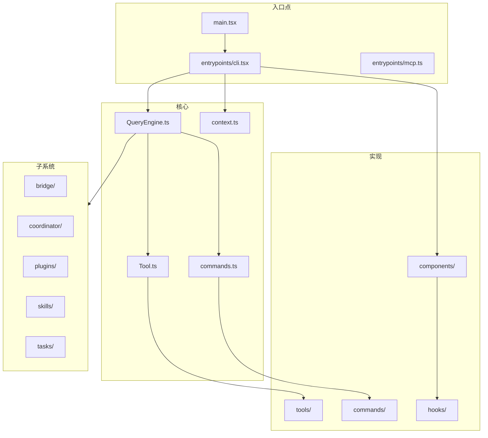
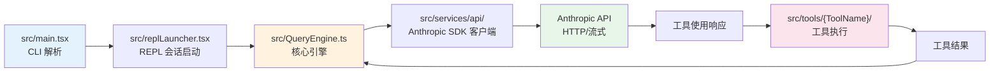
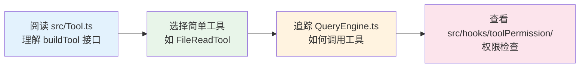
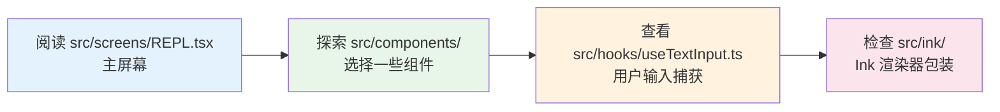
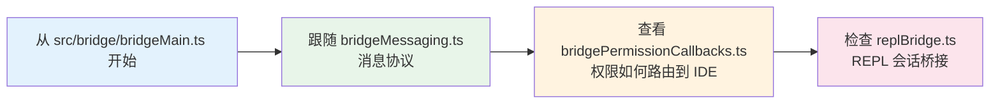
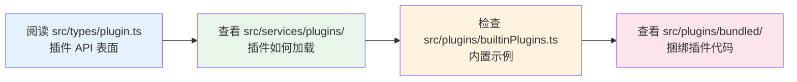
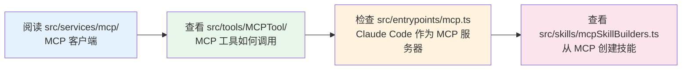

# 代码探索指南

> 如何导航和研究 Claude Code 源代码。

---

## 快速开始

这是一个**只读参考代码库** — 没有构建系统或测试套件。目标是了解生产级 AI 编程助手是如何构建的。

### 定位指南

| 要找什么 | 在哪里 |
|------|-------|
| CLI 入口点 | `src/main.tsx` |
| 核心 LLM 引擎 | `src/QueryEngine.ts` (~46K 行) |
| 工具定义 | `src/Tool.ts` (~29K 行) |
| 命令注册表 | `src/commands.ts` (~25K 行) |
| 工具注册表 | `src/tools.ts` |
| 上下文收集 | `src/context.ts` |
| 所有工具实现 | `src/tools/` (40 个子目录) |
| 所有命令实现 | `src/commands/` (~85 个子目录 + 15 个文件) |

---

## 代码库结构图



---

## 如何找到特定内容

### "工具 X 如何工作？"

1. 前往 `src/tools/{ToolName}/`
2. 主实现是 `{ToolName}.ts` 或 `.tsx`
3. UI 渲染在 `UI.tsx` 中
4. 系统提示贡献在 `prompt.ts` 中

**示例 — 理解 BashTool：**
```
src/tools/BashTool/
├── BashTool.ts      ← 核心执行逻辑
├── UI.tsx           ← bash 输出如何在终端渲染
├── prompt.ts        ← 系统提示关于 bash 的内容
└── ...
```

### "命令 X 如何工作？"

1. 检查 `src/commands/{command-name}/`（目录）或 `src/commands/{command-name}.ts`（文件）
2. 查找 `getPromptForCommand()` 函数（PromptCommands）或直接实现（LocalCommands）

### "特性 X 如何工作？"

| 特性 | 从这里开始 |
|---------|-----------|
| 权限 | `src/hooks/toolPermission/` |
| IDE 桥接 | `src/bridge/bridgeMain.ts` |
| MCP 客户端 | `src/services/mcp/` |
| 插件系统 | `src/plugins/` + `src/services/plugins/` |
| 技能 | `src/skills/` |
| 语音输入 | `src/voice/` + `src/services/voice.ts` |
| 多 Agent | `src/coordinator/` |
| 内存 | `src/memdir/` |
| 认证 | `src/services/oauth/` |
| 配置模式 | `src/schemas/` |
| 状态管理 | `src/state/` |

---

## API 调用流程

追踪从用户输入到 API 响应的流程：



---

## 代码模式识别

### `buildTool()` — 工具工厂

每个工具使用此模式：

```typescript
export const MyTool = buildTool({
  name: 'MyTool',
  inputSchema: z.object({ ... }),
  async call(args, context) { },
  async checkPermissions(input, context) { },
})
```

### 特性开关门控

```typescript
import { feature } from 'bun:bundle'

if (feature('VOICE_MODE')) {
  // 如果 VOICE_MODE 关闭，此代码在构建时被剥离
}
```

### Anthropic 内部门控

```typescript
if (process.env.USER_TYPE === 'ant') {
  // 仅 Anthropic 员工特性
}
```

### Index 重新导出

大多数目录有 `index.ts` 重新导出公共 API：

```typescript
// src/tools/BashTool/index.ts
export { BashTool } from './BashTool.js'
```

### 延迟动态导入

重模块仅在需要时加载：

```typescript
const { OpenTelemetry } = await import('./heavy-module.js')
```

### ESM 与 `.js` 扩展名

Bun 约定 — 所有导入使用 `.js` 扩展名，即使是 `.ts` 文件：

```typescript
import { something } from './utils.js'  // 实际导入 utils.ts
```

---

## 按大小排序的关键文件

最大文件包含最多逻辑，值得研究：

```mermaid
barchart title 关键文件大小
    y-axis 行数
    x-axis 文件
    bar "QueryEngine.ts" 46000
    bar "Tool.ts" 29000
    bar "commands.ts" 25000
    bar "main.tsx" 2000
    bar "context.ts" 1500
```

| 文件 | 行数 | 内容 |
|------|------|------|
| `QueryEngine.ts` | ~46K | 流式处理、工具循环、重试、Token 计数 |
| `Tool.ts` | ~29K | 工具类型、`buildTool`、权限模型 |
| `commands.ts` | ~25K | 命令注册表、条件加载 |
| `main.tsx` | — | CLI 解析器、启动优化 |
| `context.ts` | — | OS、shell、git、用户上下文组装 |

---

## 学习路径

### 路径 1: "工具如何端到端工作？"



1. 阅读 `src/Tool.ts` — 理解 `buildTool` 接口
2. 选择简单工具如 `FileReadTool` 在 `src/tools/FileReadTool/`
3. 追踪 `QueryEngine.ts` 如何在工具循环中调用工具
4. 查看 `src/hooks/toolPermission/` 中权限如何检查

### 路径 2: "UI 如何工作？"



1. 阅读 `src/screens/REPL.tsx` — 主屏幕
2. 探索 `src/components/` — 选择一些组件
3. 查看 `src/hooks/useTextInput.ts` — 用户输入如何捕获
4. 检查 `src/ink/` — Ink 渲染器包装

### 路径 3: "IDE 集成如何工作？"



1. 从 `src/bridge/bridgeMain.ts` 开始
2. 跟随 `bridgeMessaging.ts` 了解消息协议
3. 查看 `bridgePermissionCallbacks.ts` 了解权限如何路由到 IDE
4. 检查 `replBridge.ts` 了解 REPL 会话桥接

### 路径 4: "插件如何扩展 Claude Code？"



1. 阅读 `src/types/plugin.ts` — 插件 API 表面
2. 查看 `src/services/plugins/` — 插件如何加载
3. 检查 `src/plugins/builtinPlugins.ts` — 内置示例
4. 查看 `src/plugins/bundled/` — 捆绑插件代码

### 路径 5: "MCP 如何工作？"



1. 阅读 `src/services/mcp/` — MCP 客户端
2. 查看 `src/tools/MCPTool/` — MCP 工具如何调用
3. 检查 `src/entrypoints/mcp.ts` — Claude Code 作为 MCP 服务器
4. 查看 `src/skills/mcpSkillBuilders.ts` — 从 MCP 创建技能

---

## Grep 模式

用于查找内容的有用 grep/ripgrep 模式：

```bash
# 查找所有工具定义
rg "buildTool\(" src/tools/

# 查找所有命令定义
rg "satisfies Command" src/commands/

# 查找特性标志使用
rg "feature\(" src/

# 查找 Anthropic 内部门控
rg "USER_TYPE.*ant" src/

# 查找所有 React hooks
rg "^export function use" src/hooks/

# 查找所有 Zod 模式
rg "z\.object\(" src/schemas/

# 查找所有系统提示贡献
rg "prompt\(" src/tools/*/prompt.ts

# 查找权限规则模式
rg "checkPermissions" src/tools/
```

---

## 相关文档

- [架构总览](architecture.md) — 整体系统设计
- [工具系统](tools.md) — 完整工具目录
- [命令系统](commands.md) — 所有斜杠命令
- [子系统详解](subsystems.md) — Bridge、MCP、权限等深入介绍
