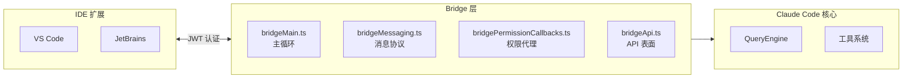
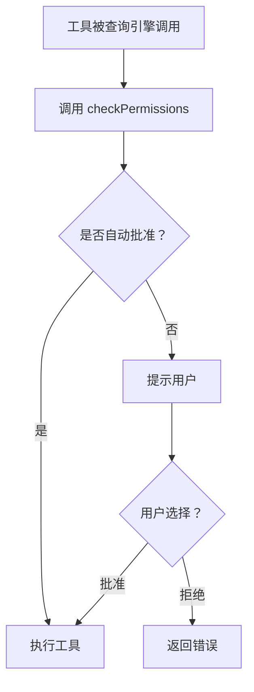
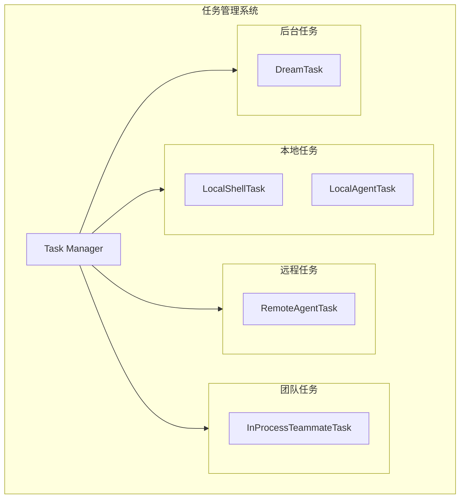
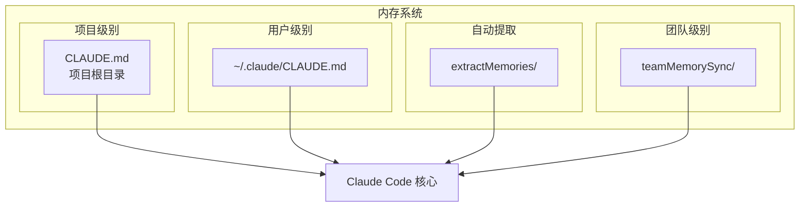
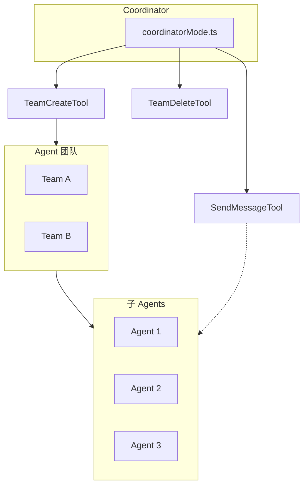
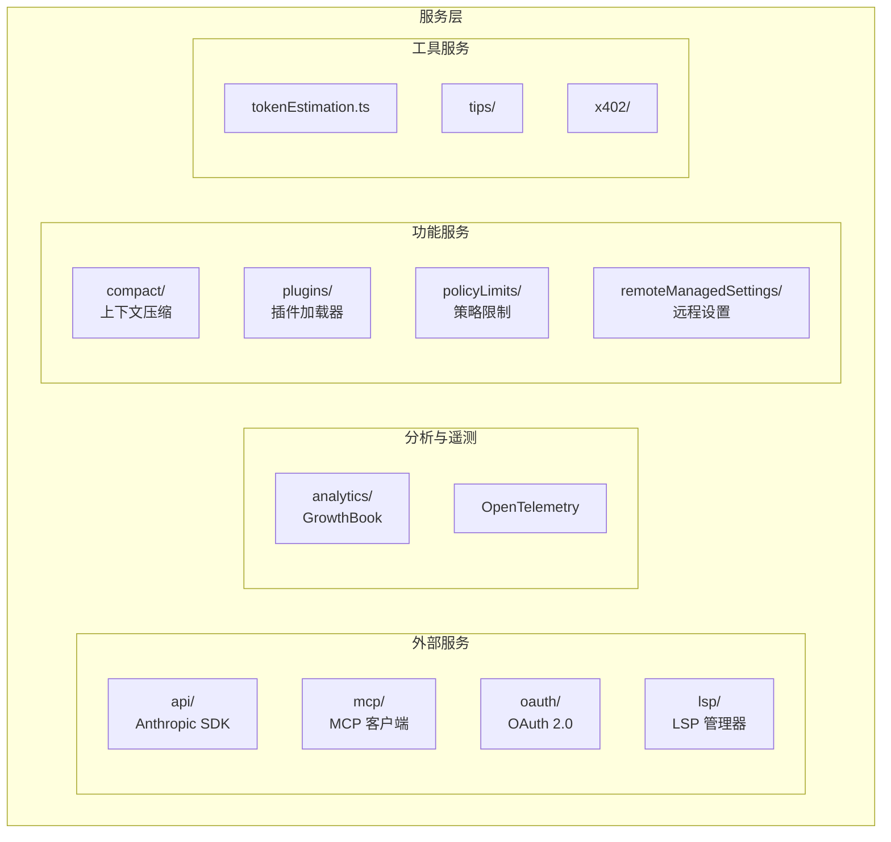

# 子系统详解

> Claude Code 主要子系统的详细文档。

---

## 目录

- [Bridge (IDE 集成)](#bridge-ide-集成)
- [MCP (Model Context Protocol)](#mcp-model-context-protocol)
- [权限系统](#权限系统)
- [插件系统](#插件系统)
- [技能系统](#技能系统)
- [任务系统](#任务系统)
- [内存系统](#内存系统)
- [Coordinator (多 Agent)](#coordinator-多-agent)
- [语音系统](#语音系统)
- [服务层](#服务层)

---

## Bridge (IDE 集成)

**位置：** `src/bridge/`

Bridge 是一个双向通信层，连接 Claude Code 的 CLI 与 IDE 扩展（VS Code、JetBrains）。它允许 CLI 作为基于 IDE 的界面的后端运行。

### 架构



### 关键文件

| 文件 | 用途 |
|------|------|
| `bridgeMain.ts` | 主桥接循环 — 启动双向通道 |
| `bridgeMessaging.ts` | 消息协议（序列化/反序列化） |
| `bridgePermissionCallbacks.ts` | 将权限提示路由到 IDE |
| `bridgeApi.ts` | 暴露给 IDE 的 API 表面 |
| `bridgeConfig.ts` | Bridge 配置 |
| `replBridge.ts` | 将 REPL 会话连接到桥接 |
| `jwtUtils.ts` | CLI 与 IDE 之间的基于 JWT 的认证 |
| `sessionRunner.ts` | 管理桥接会话执行 |
| `createSession.ts` | 创建新桥接会话 |
| `trustedDevice.ts` | 设备信任验证 |
| `workSecret.ts` | 工作区范围密钥 |
| `inboundMessages.ts` | 处理来自 IDE 的消息 |
| `inboundAttachments.ts` | 处理来自 IDE 的文件附件 |
| `types.ts` | Bridge 协议的 TypeScript 类型 |

### 特性开关

Bridge 由 `BRIDGE_MODE` 特性开关控制，并从非 IDE 构建中剥离。

---

## MCP (Model Context Protocol)

**位置：** `src/services/mcp/`

Claude Code 既作为 **MCP 客户端**（消费来自 MCP 服务器的工具/资源），也可以作为 **MCP 服务器**运行（通过 `src/entrypoints/mcp.ts` 暴露自己的工具）。

### 客户端功能

- **工具发现** — 枚举来自连接 MCP 服务器的工具
- **资源浏览** — 列出和读取 MCP 暴露的资源
- **动态工具加载** — `ToolSearchTool` 在运行时发现工具
- **认证** — `McpAuthTool` 处理 MCP 服务器认证流
- **连接监控** — `useMcpConnectivityStatus` hook 追踪连接健康

### 服务器模式

通过 `src/entrypoints/mcp.ts` 启动时，Claude Code 通过 MCP 协议暴露自己的工具和资源，允许其他 AI Agent 将 Claude Code 用作工具服务器。

### 相关工具

| 工具 | 用途 |
|------|------|
| `MCPTool` | 在连接的 MCP 服务器上调用工具 |
| `ListMcpResourcesTool` | 列出可用 MCP 资源 |
| `ReadMcpResourceTool` | 读取特定 MCP 资源 |
| `McpAuthTool` | 与 MCP 服务器认证 |
| `ToolSearchTool` | 从 MCP 服务器发现延迟工具 |

### 配置

MCP 服务器通过 `/mcp` 命令或设置文件配置。服务器审批流位于 `src/services/mcpServerApproval.tsx`。

---

## 权限系统

**位置：** `src/hooks/toolPermission/`

每个工具调用在执行前都通过集中式权限检查。

### 权限模式

| 模式 | 行为 |
|------|------|
| `default` | 对每个潜在破坏性操作提示用户 |
| `plan` | 显示完整执行计划，询问一次批量批准 |
| `bypassPermissions` | 自动批准所有操作（危险 — 仅用于受信任环境） |
| `auto` | 基于 ML 的分类器自动决定（实验性） |

### 工作流程



### 权限规则

规则使用通配符模式匹配工具调用：

```
Bash(git *)           # 允许所有 git 命令无需提示
Bash(npm test)        # 特别允许 'npm test'
FileEdit(/src/*)      # 允许编辑 src/ 下的任何内容
FileRead(*)           # 允许读取任何文件
```

### 关键文件

| 文件 | 路径 |
|------|------|
| 权限上下文 | `src/hooks/toolPermission/PermissionContext.ts` |
| 权限处理器 | `src/hooks/toolPermission/handlers/` |
| 权限日志 | `src/hooks/toolPermission/permissionLogging.ts` |
| 权限类型 | `src/types/permissions.ts` |

---

## 插件系统

**位置：** `src/plugins/`, `src/services/plugins/`

Claude Code 支持可安装插件以扩展其功能。

### 结构

| 组件 | 位置 | 用途 |
|------|------|------|
| 插件加载器 | `src/services/plugins/` | 发现和加载插件 |
| 内置插件 | `src/plugins/builtinPlugins.ts` | 随 Claude Code 提供的插件 |
| 捆绑插件 | `src/plugins/bundled/` | 捆绑到二进制中的插件代码 |
| 插件类型 | `src/types/plugin.ts` | 插件 API 的 TypeScript 类型 |

### 插件生命周期


1. **发现** — 扫描插件目录和市场
2. **安装** — 下载并注册（`/plugin` 命令）
3. **加载** — 在启动时或按需初始化
4. **执行** — 插件可以贡献工具、命令和提示
5. **自动更新** — `usePluginAutoupdateNotification` 处理更新

### 相关命令

| 命令 | 用途 |
|------|------|
| `/plugin` | 安装、移除或管理插件 |
| `/reload-plugins` | 重新加载所有已安装插件 |

---

## 技能系统

**位置：** `src/skills/`

技能是可重用的命名工作流，为特定任务捆绑提示和工具配置。

### 结构

| 组件 | 位置 | 用途 |
|------|------|------|
| 捆绑技能 | `src/skills/bundled/` | 随 Claude Code 提供的技能 |
| 技能加载器 | `src/skills/loadSkillsDir.ts` | 从磁盘加载技能 |
| MCP 技能构建器 | `src/skills/mcpSkillBuilders.ts` | 从 MCP 资源创建技能 |
| 技能注册表 | `src/skills/bundledSkills.ts` | 所有捆绑技能的注册 |

### 捆绑技能 (16 个)

| 技能 | 用途 |
|-------|------|
| `batch` | 跨多个文件的批处理操作 |
| `claudeApi` | 直接 Anthropic API 交互 |
| `claudeInChrome` | Chrome 扩展集成 |
| `debug` | 调试工作流 |
| `keybindings` | 键位绑定配置 |
| `loop` | 迭代优化循环 |
| `loremIpsum` | 生成占位文本 |
| `remember` | 持久化信息到内存 |
| `scheduleRemoteAgents` | 为远程执行调度 Agent |
| `simplify` | 简化复杂代码 |
| `skillify` | 从工作流创建新技能 |
| `stuck` | 卡住时获取帮助 |
| `updateConfig` | 以编程方式修改配置 |
| `verify` / `verifyContent` | 验证代码正确性 |

### 执行

技能通过 `SkillTool` 或 `/skills` 命令调用。用户也可以创建自定义技能。

---

## 任务系统

**位置：** `src/tasks/`

管理后台和并行工作项 — shell 任务、Agent 任务和队友 Agent。

### 任务类型

| 类型 | 位置 | 用途 |
|------|------|------|
| `LocalShellTask` | `LocalShellTask/` | 后台 shell 命令执行 |
| `LocalAgentTask` | `LocalAgentTask/` | 本地运行的子 Agent |
| `RemoteAgentTask` | `RemoteAgentTask/` | 在远程机器上运行的 Agent |
| `InProcessTeammateTask` | `InProcessTeammateTask/` | 并行队友 Agent |
| `DreamTask` | `DreamTask/` | 后台 "梦想" 进程 |
| `LocalMainSessionTask` | `LocalMainSessionTask.ts` | 作为主任务的任务 |

### 任务架构



### 任务工具

| 工具 | 用途 |
|------|------|
| `TaskCreateTool` | 创建新后台任务 |
| `TaskUpdateTool` | 更新任务状态 |
| `TaskGetTool` | 检索任务详情 |
| `TaskListTool` | 列出所有任务 |
| `TaskOutputTool` | 获取任务输出 |
| `TaskStopTool` | 停止运行中的任务 |

---

## 内存系统

**位置：** `src/memdir/`

Claude Code 的持久化内存系统，基于 `CLAUDE.md` 文件。

### 内存层级

| 范围 | 位置 | 用途 |
|------|------|------|
| 项目内存 | 项目根目录的 `CLAUDE.md` | 项目特定事实、约定 |
| 用户内存 | `~/.claude/CLAUDE.md` | 用户偏好、跨项目 |
| 提取的记忆 | `src/services/extractMemories/` | 从对话自动提取 |
| 团队内存同步 | `src/services/teamMemorySync/` | 共享团队知识 |

### 内存架构



### 相关

- `/memory` 命令用于管理记忆
- `remember` 技能用于持久化信息
- `useMemoryUsage` hook 用于追踪内存大小

---

## Coordinator (多 Agent)

**位置：** `src/coordinator/`

编排多个 Agent 并行处理任务的不同方面。

### 工作原理



- `coordinatorMode.ts` 管理协调器生命周期
- `TeamCreateTool` 和 `TeamDeleteTool` 管理 Agent 团队
- `SendMessageTool` 实现 Agent 间通信
- `AgentTool` 生成子 Agent

由 `COORDINATOR_MODE` 特性开关控制。

---

## 语音系统

**位置：** `src/voice/`

语音输入/输出支持，用于免提交互。

### 组件

| 文件 | 位置 | 用途 |
|------|------|------|
| 语音服务 | `src/services/voice.ts` | 核心语音处理 |
| STT 流 | `src/services/voiceStreamSTT.ts` | 语音转文本流 |
| 关键词 | `src/services/voiceKeyterms.ts` | 领域特定词汇 |
| 语音 hooks | `src/hooks/useVoice.ts` | React hooks |
| 语音命令 | `src/commands/voice/` | `/voice` 斜杠命令 |

### 语音流程


由 `VOICE_MODE` 特性开关控制。

---

## 服务层

**位置：** `src/services/`

外部集成和共享服务。



| 服务 | 路径 | 用途 |
|---------|------|------|
| **API** | `api/` | Anthropic SDK 客户端、文件上传、引导 |
| **MCP** | `mcp/` | MCP 客户端连接和工具发现 |
| **OAuth** | `oauth/` | OAuth 2.0 认证流 |
| **LSP** | `lsp/` | 语言服务器协议管理器 |
| **Analytics** | `analytics/` | GrowthBook 特性标志、遥测 |
| **Plugins** | `plugins/` | 插件加载器和市场 |
| **Compact** | `compact/` | 对话上下文压缩 |
| **Policy Limits** | `policyLimits/` | 组织速率限制/配额 |
| **Remote Settings** | `remoteManagedSettings/` | 企业管理设置同步 |
| **Token Estimation** | `tokenEstimation.ts` | Token 计数估计 |
| **Team Memory** | `teamMemorySync/` | 团队知识同步 |
| **Tips** | `tips/` | 上下文使用提示 |
| **Agent Summary** | `AgentSummary/` | Agent 工作总结 |
| **Prompt Suggestion** | `PromptSuggestion/` | 建议的后续提示 |
| **Session Memory** | `SessionMemory/` | 会话级内存 |
| **Magic Docs** | `MagicDocs/` | 文档生成 |
| **Auto Dream** | `autoDream/` | 后台构思 |
| **x402** | `x402/` | x402 支付协议 |

---

## 相关文档

- [架构总览](architecture.md) — 子系统如何在核心管道中连接
- [工具系统](tools.md) — 与每个子系统相关的工具
- [命令系统](commands.md) — 管理子系统的命令
- [代码探索指南](exploration-guide.md) — 查找子系统源代码
