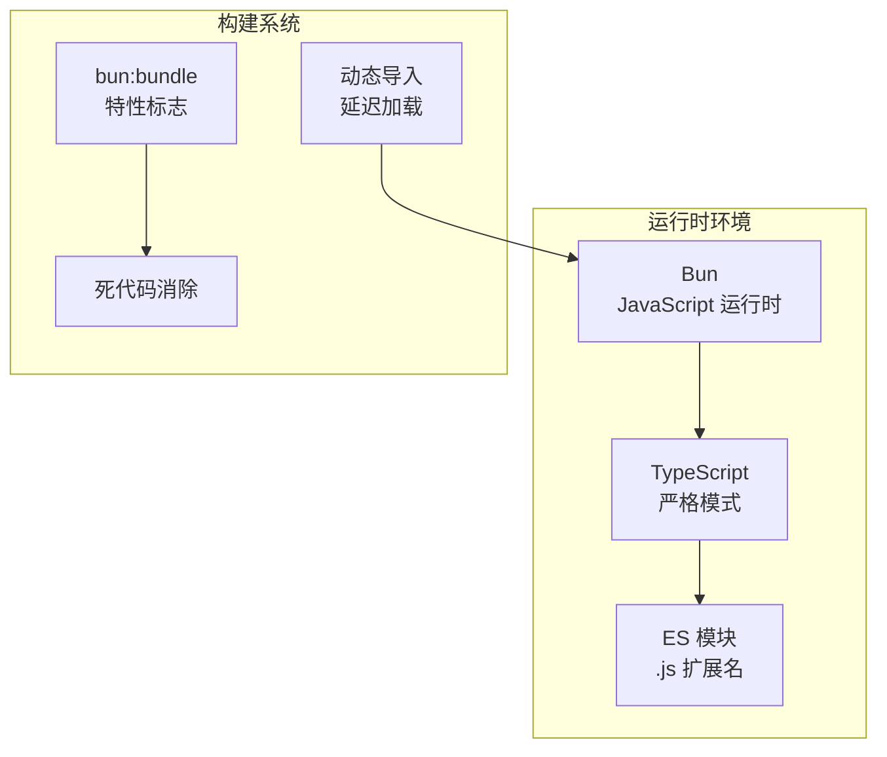
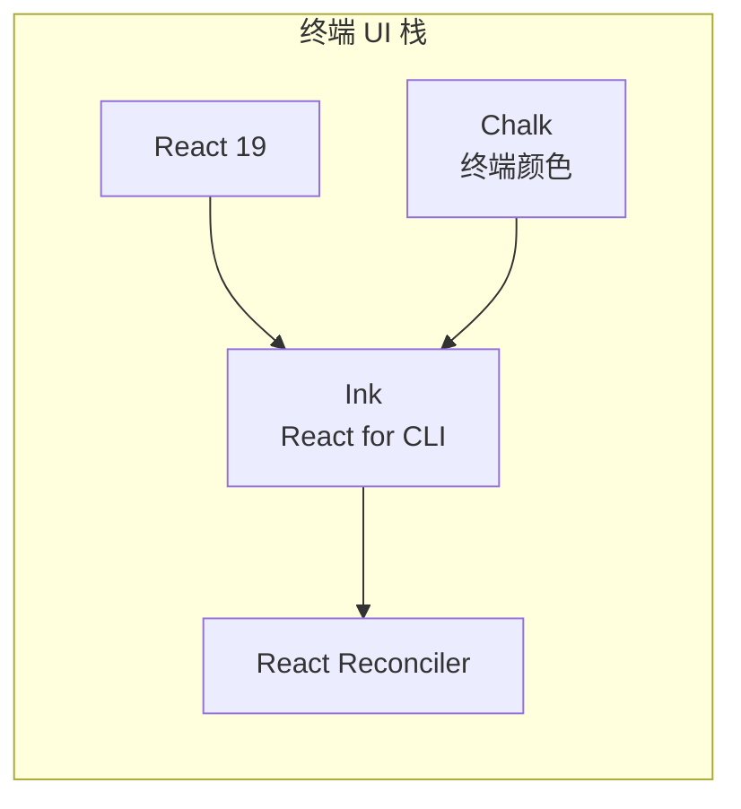
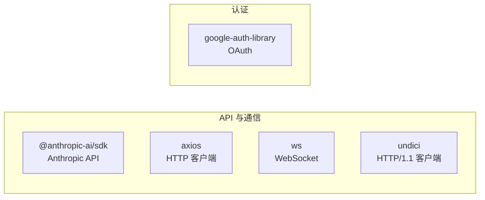
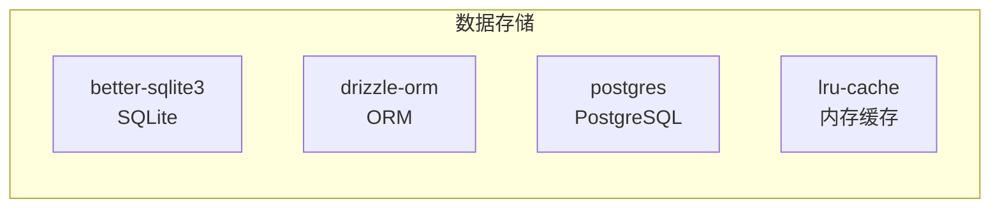
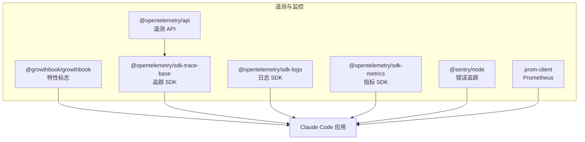
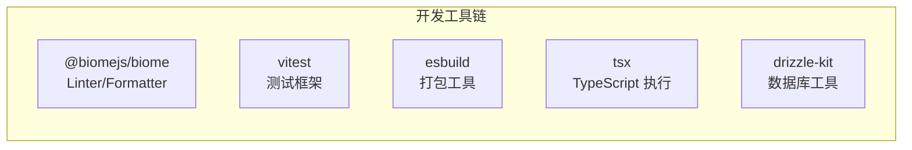
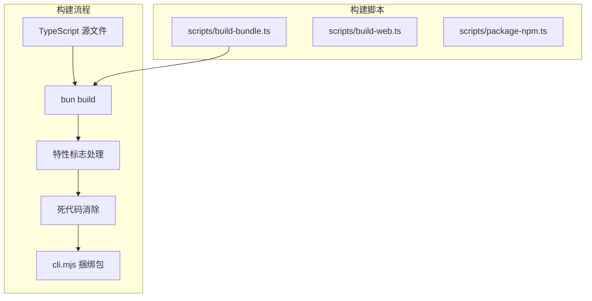

# 技术栈详情

> Claude Code 使用的技术、框架和工具完整列表。

---

## 运行时与语言

| 类别 | 技术 | 说明 |
|------|------|------|
| **运行时** | [Bun](https://bun.sh) | 高性能 JavaScript 运行时 |
| **语言** | TypeScript (严格模式) | 带完整类型安全的静态类型 |
| **模块** | ES 模块 | 使用 `.js` 扩展名（Bun 约定） |

---

## 核心依赖

### UI 与终端

| 包 | 版本 | 用途 |
|----|------|------|
| `react` | ^19.0.0 | UI 组件基础 |
| `react-reconciler` | ^0.31.0 | 自定义渲染器支持 |
| `ink` | (内置) | 终端 React 渲染 |
| `chalk` | ^5.4.0 | 终端样式和颜色 |

### CLI 与解析

| 包 | 版本 | 用途 |
|----|------|------|
| `@commander-js/extra-typings` | ^13.1.0 | 带类型的 CLI 参数解析 |
| `figur`es | ^6.1.0 | 终端 Unicode 图标 |
| `cli-boxes` | ^3.0.0 | 终端框绘制 |

### API 与网络

| 包 | 版本 | 用途 |
|----|------|------|
| `@anthropic-ai/sdk` | ^0.39.0 | Anthropic API 客户端 |
| `axios` | ^1.7.0 | HTTP 请求 |
| `ws` | ^8.18.0 | WebSocket 连接 |
| `undici` | ^7.3.0 | 高性能 HTTP 客户端 |
| `google-auth-library` | ^10.6.2 | OAuth 认证 |

### 数据验证与模式

| 包 | 版本 | 用途 |
|----|------|------|
| `zod` | ^3.24.0 | 运行时类型验证 |
| `jsonc-parser` | ^3.3.1 | JSONC 解析 |
| `yaml` | ^2.6.0 | YAML 解析 |

### 数据库与存储

| 包 | 版本 | 用途 |
|----|------|------|
| `better-sqlite3` | ^12.8.0 | SQLite 数据库 |
| `drizzle-orm` | ^0.45.2 | TypeScript ORM |
| `postgres` | ^3.4.8 | PostgreSQL 客户端 |
| `lru-cache` | ^11.2.7 | 内存 LRU 缓存 |

---

## 工具与实用库

### 文件与进程

| 包 | 版本 | 用途 |
|----|------|------|
| `execa` | ^9.5.0 | 进程执行 |
| `node-pty` | ^1.1.0 | 伪终端 |
| `chokidar` | ^4.0.0 | 文件监控 |
| `picomatch` | ^4.0.0 | Glob 匹配 |
| `proper-lockfile` | ^4.1.2 | 文件锁定 |
| `tree-kill` | ^1.2.2 | 进程树终止 |

### 终端与显示

| 包 | 版本 | 用途 |
|----|------|------|
| `@alcalzone/ansi-tokenize` | ^0.3.0 | ANSI 序列解析 |
| `wrap-ansi` | ^9.0.0 | 文本换行 |
| `strip-ansi` | ^7.1.0 | 去除 ANSI 码 |
| `bidi-js` | ^1.0.3 | 双向文本 |
| `code-excerpt` | ^4.0.0 | 代码摘录 |
| `highlight.js` | ^11.11.0 | 语法高亮 |
| `marked` | ^15.0.0 | Markdown 解析 |

### 安全与加密

| 包 | 版本 | 用途 |
|----|------|------|
| `xss` | ^1.0.15 | XSS 过滤 |
| `ignore` | ^6.0.0 | Gitignore 模式 |

---

## 遥测与监控

| 包 | 版本 | 用途 |
|----|------|------|
| `@growthbook/growthbook` | ^1.4.0 | 特性标志与 A/B 测试 |
| `@opentelemetry/api` | ^1.9.0 | 遥测 API |
| `@opentelemetry/sdk-trace-base` | ^1.30.0 | 分布式追踪 |
| `@opentelemetry/sdk-logs` | ^0.57.0 | 日志收集 |
| `@opentelemetry/sdk-metrics` | ^1.30.0 | 指标收集 |
| `@sentry/node` | ^8.45.0 | 错误监控 |
| `prom-client` | ^15.1.3 | Prometheus 指标 |

---

## MCP 与协议

| 包 | 版本 | 用途 |
|----|------|------|
| `@modelcontextprotocol/sdk` | ^1.12.1 | Model Context Protocol |
| `vscode-jsonrpc` | ^8.2.1 | JSON-RPC 协议 |
| `vscode-languageserver-protocol` | ^3.17.5 | LSP 协议 |

---

## 日志与调试

| 包 | 版本 | 用途 |
|----|------|------|
| `pino` | ^9.5.0 | 结构化日志 |
| `pino-pretty` | ^13.0.0 | 日志美化 |
| `stack-utils` | ^2.0.6 | 堆栈跟踪处理 |
| `diff` | ^7.0.0 | 文本差异 |

---

## 其他工具

| 包 | 版本 | 用途 |
|----|------|------|
| `fuse.js` | ^7.0.0 | 模糊搜索 |
| `lodash-es` | ^4.17.21 | 实用函数 |
| `auto-bind` | ^5.0.1 | 自动方法绑定 |
| `semver` | ^7.6.0 | 语义化版本 |
| `qrcode` | ^1.5.0 | QR 码生成 |
| `asciichart` | ^1.5.25 | ASCII 图表 |
| `p-map` | ^7.0.0 | 并发映射 |
| `type-fest` | ^4.30.0 | TypeScript 类型工具 |
| `usehooks-ts` | ^3.1.0 | TypeScript React Hooks |

---

## 开发工具

| 包 | 版本 | 用途 |
|----|------|------|
| `@biomejs/biome` | ^1.9.0 | Linting 和格式化 |
| `vitest` | ^4.1.2 | 测试框架 |
| `esbuild` | ^0.25.0 | 快速打包 |
| `tsx` | ^4.21.0 | TypeScript 直接执行 |
| `drizzle-kit` | ^0.31.10 | 数据库迁移工具 |
| `typescript` | ^5.7.0 | TypeScript 编译器 |

---

## 构建流程

---

## 版本要求

| 组件 | 最低版本 |
|------|----------|
| Bun | >= 1.1.0 |
| TypeScript | ^5.7.0 |
| Node.js API | 兼容 |

---

## 相关文档

- [架构总览](architecture.md) — 技术栈如何支持架构
- [部署与运维](deployment.md) — 生产环境配置
