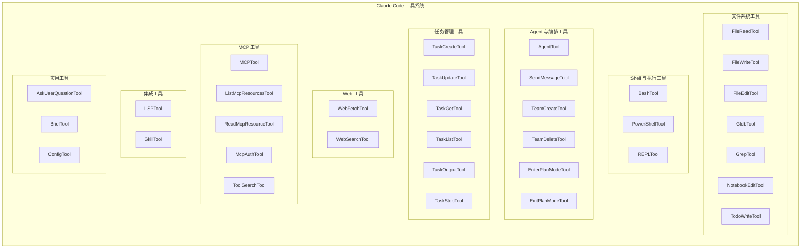

# 工具系统

> Claude Code 中所有 ~40 个 Agent 工具的完整目录。

---

## 概览

每个工具位于 `src/tools/<ToolName>/` 中，是一个自包含模块。每个工具定义：

- **输入模式** — Zod 验证的参数
- **权限模型** — 需要什么用户批准
- **执行逻辑** — 工具的实现
- **UI 组件** — 在终端中渲染调用和结果
- **并发安全** — 是否可以并行运行

工具在 `src/tools.ts` 中注册，并在 LLM 工具调用循环期间由查询引擎调用。

### 工具定义模式

```typescript
export const MyTool = buildTool({
  name: 'MyTool',
  aliases: ['my_tool'],
  description: 'What this tool does',
  inputSchema: z.object({
    param: z.string(),
  }),
  async call(args, context, canUseTool, parentMessage, onProgress) {
    // Execute and return { data: result, newMessages?: [...] }
  },
  async checkPermissions(input, context) { /* Permission checks */ },
  isConcurrencySafe(input) { /* Can run in parallel? */ },
  isReadOnly(input) { /* Non-destructive? */ },
  prompt(options) { /* System prompt injection */ },
  renderToolUseMessage(input, options) { /* UI for invocation */ },
  renderToolResultMessage(content, progressMessages, options) { /* UI for result */ },
})
```

**每个工具的目录结构：**

```
src/tools/MyTool/
├── MyTool.ts        # 主实现
├── UI.tsx           # 终端渲染
├── prompt.ts        # 系统提示词贡献
└── utils.ts         # 工具特定辅助函数
```

---

## 工具分类架构



---

## 文件系统工具

| 工具 | 描述 | 只读 |
|------|------|------|
| **FileReadTool** | 读取文件内容（文本、图像、PDF、笔记本）。支持行范围 | 是 |
| **FileWriteTool** | 创建或覆盖文件 | 否 |
| **FileEditTool** | 通过字符串替换进行部分文件修改 | 否 |
| **GlobTool** | 查找匹配 glob 模式的文件（例如 `**/*.ts`） | 是 |
| **GrepTool** | 使用 ripgrep 进行内容搜索（支持正则） | 是 |
| **NotebookEditTool** | 编辑 Jupyter 笔记本单元格 | 否 |
| **TodoWriteTool** | 写入结构化待办/任务文件 | 否 |

---

## Shell 与执行工具

| 工具 | 描述 | 只读 |
|------|------|------|
| **BashTool** | 在 bash 中执行 shell 命令 | 否 |
| **PowerShellTool** | 执行 PowerShell 命令（Windows） | 否 |
| **REPLTool** | 在 REPL 会话中运行代码（Python、Node 等） | 否 |

---

## Agent 与编排工具

| 工具 | 描述 | 只读 |
|------|------|------|
| **AgentTool** | 生成子 Agent 处理复杂任务 | 否 |
| **SendMessageTool** | 在 Agent 之间发送消息 | 否 |
| **TeamCreateTool** | 创建并行 Agent 团队 | 否 |
| **TeamDeleteTool** | 移除团队 Agent | 否 |
| **EnterPlanModeTool** | 切换到计划模式（不执行） | 否 |
| **ExitPlanModeTool** | 退出计划模式，恢复执行 | 否 |
| **EnterWorktreeTool** | 在 git worktree 中隔离工作 | 否 |
| **ExitWorktreeTool** | 退出 worktree 隔离 | 否 |
| **SleepTool** | 暂停执行（主动模式） | 是 |
| **SyntheticOutputTool** | 生成结构化输出 | 是 |

---

## 任务管理工具

| 工具 | 描述 | 只读 |
|------|------|------|
| **TaskCreateTool** | 创建新后台任务 | 否 |
| **TaskUpdateTool** | 更新任务状态或详情 | 否 |
| **TaskGetTool** | 获取特定任务详情 | 是 |
| **TaskListTool** | 列出所有任务 | 是 |
| **TaskOutputTool** | 获取已完成任务的输出 | 是 |
| **TaskStopTool** | 停止运行中的任务 | 否 |

---

## Web 工具

| 工具 | 描述 | 只读 |
|------|------|------|
| **WebFetchTool** | 从 URL 获取内容 | 是 |
| **WebSearchTool** | 搜索网页 | 是 |

---

## MCP (Model Context Protocol) 工具

| 工具 | 描述 | 只读 |
|------|------|------|
| **MCPTool** | 在连接的 MCP 服务器上调用工具 | 可变 |
| **ListMcpResourcesTool** | 列出 MCP 暴露的资源 | 是 |
| **ReadMcpResourceTool** | 读取特定 MCP 资源 | 是 |
| **McpAuthTool** | 处理 MCP 服务器认证 | 否 |
| **ToolSearchTool** | 从 MCP 服务器发现延迟/动态工具 | 是 |

---

## 集成工具

| 工具 | 描述 | 只读 |
|------|------|------|
| **LSPTool** | 语言服务器协议操作（跳转到定义、查找引用等） | 是 |
| **SkillTool** | 执行已注册的技能 | 可变 |

---

## 调度与触发工具

| 工具 | 描述 | 只读 |
|------|------|------|
| **ScheduleCronTool** | 创建定时 cron 触发器 | 否 |
| **RemoteTriggerTool** | 触发远程触发器 | 否 |

---

## 实用工具

| 工具 | 描述 | 只读 |
|------|------|------|
| **AskUserQuestionTool** | 执行期间提示用户输入 | 是 |
| **BriefTool** | 生成简要/总结 | 是 |
| **ConfigTool** | 读取或修改 Claude Code 配置 | 否 |

---

## 权限模型

每个工具调用都通过权限系统 (`src/hooks/toolPermission/`)。权限模式：

| 模式 | 行为 |
|------|------|
| `default` | 对每个潜在破坏性操作提示用户 |
| `plan` | 显示完整计划，询问一次批量批准 |
| `bypassPermissions` | 自动批准所有操作（危险 — 仅用于受信任环境） |
| `auto` | 基于 ML 的分类器自动决定（实验性） |

权限规则使用通配符模式：

```
Bash(git *)           # 允许所有 git 命令无需提示
Bash(npm test)        # 特别允许 'npm test'
FileEdit(/src/*)      # 允许编辑 src/ 下的任何内容
FileRead(*)           # 允许读取任何文件
```

每个工具实现 `checkPermissions()` 返回 `{ granted: boolean, reason?, prompt? }`。

---

## 工具预设

工具在 `src/tools.ts` 中分组为预设，用于不同上下文（例如代码审查的只读工具，开发的完整工具集）。

---

## 相关文档

- [架构总览](architecture.md) — 工具如何适应整体管道
- [子系统详解](subsystems.md) — MCP、权限和其他工具相关子系统
- [代码探索指南](exploration-guide.md) — 如何阅读工具源代码
